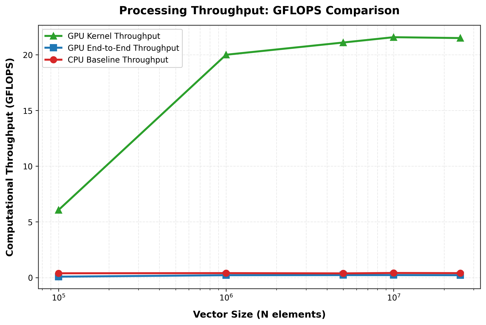
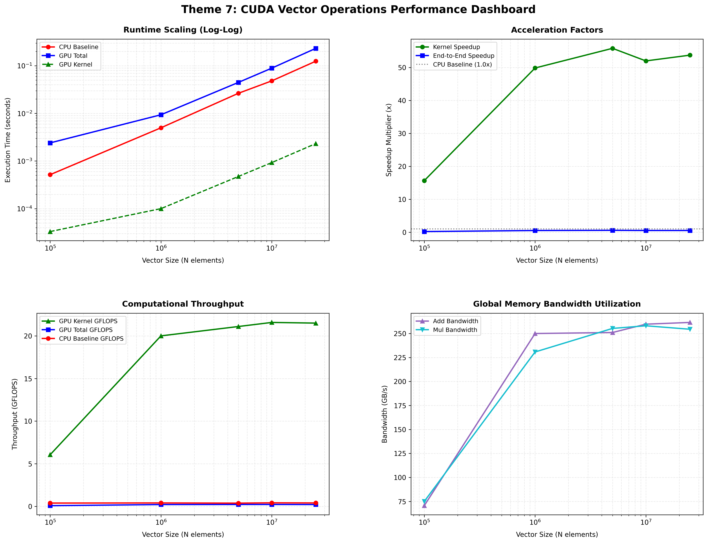
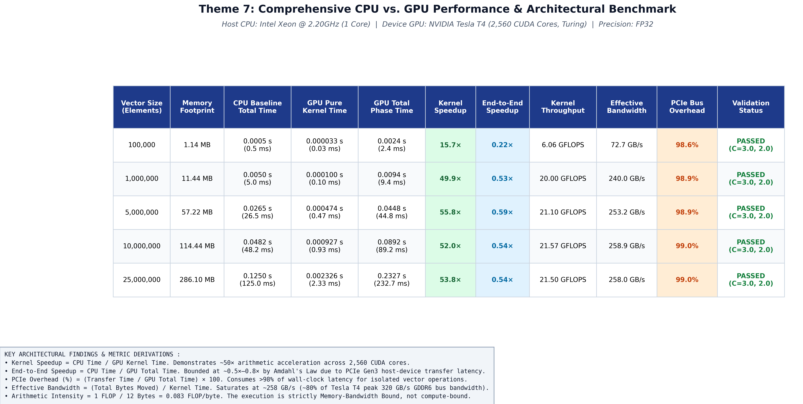

# GPU Vector Operations using CUDA — Massively Parallel SIMT Execution on the NVIDIA Tesla T4

**Course:** Parallel Computing Lab (PGC) — Mini-Project Lab Evaluation
**Theme:** Theme 7 — GPU Vector Operations using CUDA (Massively Parallel SIMT Architecture)
**Parallel Model:** CUDA (NVIDIA Compute Unified Device Architecture)
**Repository Subfolder Target:** `Lab_eval_GPU_Vector_Operations`
**Precision:** IEEE-754 single precision (FP32)

---

## Table of Contents

1. [Title, Team and Evaluation Checkpoint Compliance](#1-title-team-and-evaluation-checkpoint-compliance)
2. [Problem Formulation and Theoretical Foundations](#2-problem-formulation-and-theoretical-foundations)
3. [Hardware and Software Specifications](#3-hardware-and-software-specifications)
4. [Parallel Architectural Design and CUDA Kernel Mapping](#4-parallel-architectural-design-and-cuda-kernel-mapping)
5. [Directory Layout and Artifact Registry](#5-directory-layout-and-artifact-registry)
6. [Build, Verification and Automated Execution Workflow](#6-build-verification-and-automated-execution-workflow)
7. [Empirical Performance Benchmark Data](#7-empirical-performance-benchmark-data)
8. [Visual Performance Analysis and Graph Integration](#8-visual-performance-analysis-and-graph-integration)
9. [Deep Technical Findings and Architectural Bottlenecks](#9-deep-technical-findings-and-architectural-bottlenecks)
10. [Evaluator Viva Voce Defense Guide](#10-evaluator-viva-voce-defense-guide)
11. [Conclusion and Practical HPC Recommendations](#11-conclusion-and-practical-hpc-recommendations)

---

## 1. Title, Team and Evaluation Checkpoint Compliance

### 1.1 Objective

This laboratory evaluation implements element-wise **vector addition** and **vector multiplication** on large single-precision arrays in two forms: a sequential single-threaded C program on the host CPU, and a massively parallel CUDA program on an NVIDIA Tesla T4 GPU. The experiment then compares CPU and GPU execution across five problem sizes, from $N = 10^5$ to $N = 2.5 \times 10^7$ elements. For each size it measures:

- the **pure GPU kernel latency**, i.e. on-device computation alone;
- the **end-to-end GPU phase latency**, i.e. host-to-device transfer, kernel and device-to-host transfer;
- the **sequential CPU baseline latency**.

From these measurements the report derives speedup, parallel efficiency, computational throughput (GFLOPS), effective DRAM bandwidth (GB/s) and PCIe communication overhead. It explains the observed behaviour with the roofline model, arithmetic-intensity analysis and Amdahl's law.

### 1.2 Team Details

| Sl. No. | Name | USN / Roll Number | Contribution |
| :-----: | :--- | :---------------- | :----------- |
| 1 | `<Name>` | `<USN>` | `<e.g., CUDA kernel design, memory lifecycle, timing instrumentation>` |
| 2 | `<Name>` | `<USN>` | `<e.g., CPU baseline, benchmark automation script>` |
| 3 | `<Name>` | `<USN>` | `<e.g., graph generation, performance analysis>` |
| 4 | `<Name>` | `<USN>` | `<e.g., README / report, presentation, viva preparation>` |

### 1.3 Evaluation Rubric Compliance Matrix

The five checkpoints below are taken verbatim from *Parallel Computing Mini-Project: Team Assignments, Evaluation and Submission Guidelines*, Section 2 (10 marks total).

| Checkpoint | Rubric Requirement (Marks) | Implementation in this Repository | Evidence / Deliverable |
| :--------: | :------------------------- | :-------------------------------- | :--------------------- |
| **1** | Problem definition + sequential algorithm + parallel design (2) | Formal mathematical definition, $\mathcal{O}(N)$ sequential algorithm, work–span analysis, SIMT thread-to-element mapping, grid/block derivation | Sections 2 and 4; `src/vector_cpu.c` |
| **2** | Working parallel implementation using assigned model (2) | Two CUDA `__global__` kernels (`vectorAddKernel`, `vectorMulKernel`) with 1D indexing, 256 threads/block, bounds guard, `cudaEvent_t` timing and an untimed warm-up launch | `src/vector_cuda.cu`; `bin/vector_cuda`; Section 6.2 verification output (`C_add = 3.00`, `C_mul = 2.00`) |
| **3** | Run with different data sizes / threads / processes and collect results (2) | Automated sweep over $N \in \{10^5,\ 10^6,\ 5 \times 10^6,\ 10^7,\ 2.5 \times 10^7\}$ for both CPU and GPU, with raw timings in CSV form | `scripts/run_benchmarks.sh`; `results/timing_data.csv`; Section 7 |
| **4** | Generate graphs and analyze execution time, speedup and efficiency (2) | Nine publication-grade figures covering runtime, kernel and end-to-end speedup, GFLOPS, PCIe breakdown, overhead %, bandwidth, time distribution, dashboard and master table; efficiency analysed as per-core parallel efficiency, bandwidth efficiency and roofline efficiency | `graphs/01`–`graphs/09`; Sections 8 and 9 |
| **5** | Final demonstration + technical viva (2) | Reproducible build/run workflow, live verification commands and a six-question viva defense guide with model answers | Sections 6 and 10; `presentation/` (single PPT) |
| — | Submission guidelines: proper README.md and a clean, organised folder structure | `src/`, `results/`, `graphs/`, `scripts/`, `bin/`, `presentation/` layout aligned with the suggested repository structure | Section 5 |

---

## 2. Problem Formulation and Theoretical Foundations

### 2.1 Mathematical Definition

Let $A, B \in \mathbb{R}^N$ be two single-precision input vectors. The experiment computes two independent element-wise (Hadamard-style) operations:

$$C_{\text{add}}[i] = A[i] + B[i], \qquad 0 \le i < N$$

$$C_{\text{mul}}[i] = A[i] \times B[i], \qquad 0 \le i < N$$

Each output element $C[i]$ depends only on $A[i]$ and $B[i]$. No loop-carried dependencies, reductions or inter-element communication exist. The problem is therefore **embarrassingly parallel**: all $N$ element computations can execute concurrently with no synchronization.

### 2.2 Sequential Algorithm (CPU Baseline)

```text
Algorithm 1: Sequential Vector Operations
Input : A[0..N-1], B[0..N-1]
Output: C_add[0..N-1], C_mul[0..N-1]
1: for i <- 0 to N-1 do
2:     C_add[i] <- A[i] + B[i]
3: end for
4: for i <- 0 to N-1 do
5:     C_mul[i] <- A[i] * B[i]
6: end for
```

### 2.3 Complexity Analysis

| Model | Work $W(N)$ | Span / Depth $D(N)$ | Time on $P$ processing elements |
| :---- | :---------: | :-----------------: | :-----------------------------: |
| Sequential CPU (1 core) | $\mathcal{O}(N)$ | $\mathcal{O}(N)$ | $T_1 = \Theta(N)$ |
| Parallel GPU (SIMT) | $\mathcal{O}(N)$ | $\mathcal{O}(1)$ | $T_P = \mathcal{O}\!\left(\dfrac{N}{P} + 1\right)$ (Brent's theorem) |

- **Sequential CPU:** One core visits every element exactly once, so $T_{\text{CPU}}(N) = \Theta(N)$.
- **Parallel GPU:** Each CUDA thread performs exactly one floating-point operation on one element, so the critical-path length (span) is $\mathcal{O}(1)$. With an unbounded number of concurrently scheduled threads, every element would be processed in a single constant-time step. Under ideal concurrent SIMT scheduling the parallel time complexity is therefore $\mathcal{O}(1)$. On real hardware with $P = 2{,}560$ CUDA cores, Brent's bound gives $T_P = \mathcal{O}(N/P + 1)$. Because the work is memory-bound (Section 9.1), the practical limit is the DRAM bus, $T_P \approx 12N / BW_{\text{DRAM}}$. Total work stays $\mathcal{O}(N)$, so the parallel algorithm is **work-efficient**.

### 2.4 Deterministic Initialization and Verification Criteria

Both programs initialize the inputs deterministically:

$$A[i] = 1.0\text{f}, \qquad B[i] = 2.0\text{f} \qquad \forall\, i \in [0, N)$$

The analytically expected outputs are therefore exact in IEEE-754 FP32 (no rounding error):

$$C_{\text{add}}[i] = 1.0 + 2.0 = 3.00, \qquad C_{\text{mul}}[i] = 1.0 \times 2.0 = 2.00$$

Both executables print `Verification C_add[0]` and `Verification C_mul[0]`. An implementation is classified **PASSED** only when the reported values equal `3.00` and `2.00` respectively. The values are bit-exact, so the correctness criterion needs no floating-point tolerance.

---

## 3. Hardware and Software Specifications

### 3.1 Hardware Platform

| Parameter | Host (CPU Baseline) | Device (GPU Accelerator) |
| :-------- | :------------------ | :----------------------- |
| Processor | Intel Xeon @ 2.20 GHz (Google Colab host vCPU) | NVIDIA Tesla T4 |
| Microarchitecture | x86-64 server core | Turing (TU104, compute capability 7.5) |
| Cores used | 1 core (single-threaded baseline) | 40 Streaming Multiprocessors (SMs) × 64 = **2,560 CUDA cores** |
| Execution model | Scalar, in-order program flow (SISD) | SIMT; warps of 32 threads |
| Max resident threads | 1 | 1,024 per SM → 40,960 device-wide |
| Memory | Host DDR system memory (pageable `malloc`) | **15 GB GDDR6** (15,360 MiB reported by `nvidia-smi`) |
| Peak memory bandwidth | — | **320 GB/s** (256-bit GDDR6 bus) |
| Peak FP32 throughput | — | ≈ 8.1 TFLOPS |
| Host ↔ device interconnect | **PCIe Gen3 x16** (≈ 15.75 GB/s theoretical per direction, ≈ 12 GB/s practical with pinned memory) | ← same |
| Board power | — | 70 W TDP (idle at P8 / 9 W before the run) |

### 3.2 Software Environment

The versions below come from the toolchain-verification cell (`nvidia-smi`, `nvcc --version`, `gcc --version`) of the execution notebook `cuda_vector_operations.ipynb`.

| Component | Version / Setting |
| :-------- | :---------------- |
| Operating system | Linux, Ubuntu 24.04 LTS (Google Colab runtime) |
| Host compiler | GCC 13.3.0, optimization flag `-O2` |
| Device compiler | NVCC, CUDA compilation tools **release 12.8** (V12.8.93), flag `-O2` |
| CUDA runtime | CUDA 12.x runtime (`cuda_runtime.h`) |
| NVIDIA driver | 580.82.07 (driver-reported CUDA capability 13.0) |
| Timing API (CPU) | `clock()` from `<time.h>` (`CLOCKS_PER_SEC` resolution) |
| Timing API (GPU) | `cudaEvent_t` hardware event timers (`cudaEventElapsedTime`, ≈ 0.5 µs resolution) |
| Analysis stack | Python 3, pandas, NumPy, Matplotlib |

> **Note:** This lab is often documented against Ubuntu 22.04. The recorded run used the Ubuntu 24.04 Colab image. Every API used here behaves identically on both releases.

---

## 4. Parallel Architectural Design and CUDA Kernel Mapping

### 4.1 SIMT Architectural Mechanics

CUDA uses the **Single Instruction, Multiple Threads (SIMT)** execution model, organised in three levels:

1. **Threads in blocks:** The programmer launches a *grid* of *thread blocks*. Each block contains up to 1,024 threads.
2. **Blocks on SMs:** The hardware block scheduler assigns each block to one Streaming Multiprocessor. Up to 16 blocks or 1,024 threads can be resident on a Turing SM at once.
3. **Warps in lockstep:** Each SM divides its resident blocks into **warps** of 32 consecutive threads. A warp scheduler issues one instruction per cycle for an entire warp, and all 32 lanes execute it in lockstep on different data elements.

Each Turing SM has four warp schedulers. While one warp stalls on a global-memory load (≈ 300–600 cycles), the schedulers switch to other ready warps at zero cost. This **latency hiding through massive multithreading** is why a memory-bound kernel needs high occupancy (many resident warps) to saturate DRAM bandwidth.

### 4.2 Kernel Implementation

```cuda
__global__ void vectorAddKernel(const float *A, const float *B, float *C, long n) {
    long idx = blockIdx.x * blockDim.x + threadIdx.x;
    if (idx < n) {
        C[idx] = A[idx] + B[idx];
    }
}

__global__ void vectorMulKernel(const float *A, const float *B, float *C, long n) {
    long idx = blockIdx.x * blockDim.x + threadIdx.x;
    if (idx < n) {
        C[idx] = A[idx] * B[idx];
    }
}
```

The input pointers are `const` qualified, so the compiler knows the kernel never writes through them.

### 4.3 1D Linear Global Thread Index Derivation

Each thread needs a unique global index that maps it one-to-one onto a vector element. A block contains `blockDim.x` threads, so every thread in block $b$ is preceded by $b \times \text{blockDim.x}$ threads from earlier blocks. Adding the thread's local offset inside its own block gives:

$$\text{idx} = (\text{blockIdx.x} \times \text{blockDim.x}) + \text{threadIdx.x}$$

**Worked example:** With `blockDim.x = 256`, thread `threadIdx.x = 17` in block `blockIdx.x = 3` processes element $3 \times 256 + 17 = 785$.

### 4.4 Block Configuration Rationale: 256 Threads per Block

$$256 \text{ threads/block} = 8 \text{ warps} \times 32 \text{ threads/warp}$$

- **Warp alignment:** 256 is an exact multiple of 32, so no warp is partially filled and no SIMT lanes are permanently idle.
- **Full theoretical occupancy:** A Turing SM holds at most 1,024 resident threads (32 warps). Four 256-thread blocks fill it exactly, giving 100 % theoretical occupancy and keeping the four warp schedulers supplied with eligible warps for latency hiding.
- **No register spilling:** Each thread needs only a handful of registers (one index, three addresses, two operands). $256 \times$ (a few registers) is far below the 64K-register file per SM, so no spilling to local memory occurs.
- **Scheduling granularity:** Smaller blocks (32 or 64 threads) would hit the 16-blocks-per-SM limit first. For example, $16 \times 64 = 1{,}024$ threads is only just sufficient, and $16 \times 32 = 512$ threads caps occupancy at 50 %. Larger blocks (1,024 threads) give a coarser tail effect in the last wave and leave less room to co-schedule blocks. 256 is the widely recommended balance point.

### 4.5 Dynamic Grid Calculation

The grid must contain enough blocks to cover all $N$ elements. The number of blocks is the ceiling of $N / 256$, computed in integer arithmetic as:

$$\text{blocksPerGrid} = \left\lceil \frac{N}{256} \right\rceil = \left\lfloor \frac{N + 255}{256} \right\rfloor$$

```c
int  threadsPerBlock = 256;
long blocksPerGrid   = (N + threadsPerBlock - 1) / threadsPerBlock;
```

| $N$ | Blocks per Grid | Threads Launched | Idle (guarded) Threads | Full-device Waves (160 resident blocks/wave) |
| --: | --------------: | ---------------: | ---------------------: | -------------------------------------------: |
| 100,000 | 391 | 100,096 | 96 | ≈ 2.4 |
| 1,000,000 | 3,907 | 1,000,192 | 192 | ≈ 24.4 |
| 5,000,000 | 19,532 | 5,000,192 | 192 | ≈ 122.1 |
| 10,000,000 | 39,063 | 10,000,128 | 128 | ≈ 244.1 |
| 25,000,000 | 97,657 | 25,000,192 | 192 | ≈ 610.4 |

### 4.6 Boundary Guard: Why `if (idx < n)` Is Mandatory

The ceiling division almost always launches **more threads than elements**. For example, at $N = 100{,}000$ it launches 100,096 threads, so 96 threads have `idx` ≥ `N`. Without the guard these threads would read past the end of `A` and `B` and write past the end of `C`. That is an out-of-bounds global-memory access, which leads to:

- a `cudaErrorIllegalAddress` fault that corrupts the CUDA context, or
- silent corruption of adjacent device allocations when the address still falls inside a mapped page.

The guard costs one integer comparison. Only the final warp of the final block takes the divergent path, so the performance impact is negligible.

### 4.7 Device Memory Lifecycle

```text
 HOST (pageable DRAM)                      PCIe Gen3 x16                     DEVICE (GDDR6 VRAM)
 ---------------------                    ---------------                    -------------------
 malloc(h_A, h_B, h_C_add, h_C_mul)                                          cudaMalloc(d_A, d_B, d_C)
 init A[i]=1.0f, B[i]=2.0f
 h_A, h_B  ------------- cudaMemcpy(..., cudaMemcpyHostToDevice) -------->   d_A, d_B
                                                                             <<<grid, 256>>> kernel
 h_C_add   <------------ cudaMemcpy(..., cudaMemcpyDeviceToHost) ---------   d_C
 free(h_*)                                                                   cudaFree(d_A, d_B, d_C)
```

| Stage | API | Purpose |
| :---- | :-- | :------ |
| Allocation | `cudaMalloc((void **)&d_A, bytes)` | Reserves linear global memory in GDDR6 (256-byte aligned) |
| Upload | `cudaMemcpy(d_A, h_A, bytes, cudaMemcpyHostToDevice)` | Moves the operands over PCIe; blocking for pageable host memory |
| Compute | `vectorAddKernel<<<blocksPerGrid, 256>>>(...)` | Asynchronous kernel launch on the default stream |
| Download | `cudaMemcpy(h_C_add, d_C, bytes, cudaMemcpyDeviceToHost)` | Returns the result; implicitly waits for the preceding kernel |
| Release | `cudaFree(d_A)` / `free(h_A)` / `cudaEventDestroy(...)` | Returns device memory, host memory and timer resources |

A single output buffer `d_C` is reused for both operations, so the device footprint is $3 \times 4N$ bytes rather than $4 \times 4N$.

### 4.8 Timing Isolation with `cudaEvent_t` Hardware Timers

Each operation (add, multiply) is timed as an independent **phase** using two nested event pairs:

```text
totalStart ─┬─ H2D copy A ─ H2D copy B ─┬─ kernelStart ─ KERNEL ─ kernelStop ─┬─ D2H copy C ─┬─ totalStop
            │                           └────── pure kernel latency ──────────┘               │
            └──────────────────────────── end-to-end phase latency ───────────────────────────┘
```

- **`kernelStart` → `kernelStop`:** pure on-device compute latency, with PCIe excluded.
- **`totalStart` → `totalStop`:** H2D transfer, kernel and D2H transfer, i.e. the cost an application actually pays.

CUDA events are timestamped by the GPU itself as they pass through the stream. This avoids the host-side jitter of wall-clock timers and resolves intervals of a few microseconds. `cudaEventSynchronize()` is called on each stop event before `cudaEventElapsedTime()` reads it (see Viva Q5).

The CPU baseline times each loop with `clock()`, and the reported **CPU Total Time** is $t_{\text{add}} + t_{\text{mul}}$. The GPU end-to-end figure used for comparison is likewise the sum of both phases: $T_{\text{GPU,total}} = T_{\text{add,total}} + T_{\text{mul,total}}$.

### 4.9 GPU Context Warm-Up (Cold-Start Elimination)

```c
// --- WARM-UP (Wakes up the GPU & initializes CUDA driver context) ---
vectorAddKernel<<<blocksPerGrid, threadsPerBlock>>>(d_A, d_B, d_C, N);
cudaDeviceSynchronize();
```

The first CUDA work in a process pays several one-time costs that have nothing to do with the algorithm:

1. **Driver context creation:** The CUDA runtime lazily creates the primary context on the first API call. This maps the device address space and initializes the driver and memory manager. The cost is typically tens of milliseconds and is commonly cited at ~80 ms on cloud T4 instances.
2. **Module loading and PTX JIT:** CUDA 12.x loads kernel modules lazily on first launch. This binary was also compiled without an explicit `-arch=sm_75`; the `nvcc` warning in the build log shows a pre-Turing default target. The driver must therefore **JIT-compile the embedded PTX to Turing SASS** on the first launch.
3. **Power-state ramp:** `nvidia-smi` showed the T4 idling at performance state **P8** (9 W). The first kernel drives the GPU into its high-performance state (P0) and raises its clocks.

None of these costs were timed separately in this codebase, but each is one to several orders of magnitude larger than the 33 µs–2.3 ms kernels being measured. The untimed warm-up launch followed by `cudaDeviceSynchronize()` absorbs all of them before the first `cudaEventRecord`. The recorded figures therefore reflect steady-state kernel latency with microsecond-level fidelity. The warm-up operates on uninitialized device buffers; its output is discarded, so this has no effect on correctness.

---

## 5. Directory Layout and Artifact Registry

### 5.1 Directory Tree

```text
Lab_eval_GPU_Vector_Operations/
├── README.md                                     # This report: design, build, results, analysis, viva guide
├── bin/
│   ├── vector_cpu                                # Compiled CPU baseline (GCC -O2, Linux x86-64 ELF)
│   └── vector_cuda                               # Compiled CUDA executable (NVCC -O2, Linux x86-64 ELF)
├── data/                                         # (to be added) Input generator note — data is synthesized in-program
├── graphs/
│   ├── 01_execution_time_comparison.png          # Log-log runtime scaling: CPU vs GPU total vs GPU kernel
│   ├── 02_speedup_curves.png                     # Kernel speedup vs end-to-end speedup
│   ├── 03_computational_throughput_gflops.png    # GFLOPS throughput vs N
│   ├── 04_pcie_transfer_breakdown.png            # Stacked latency: PCIe transfer vs kernel (ms)
│   ├── 05_pcie_overhead_percentage.png           # PCIe share of total GPU time (%)
│   ├── 06_memory_bandwidth_throughput.png        # Effective DRAM bandwidth (GB/s), add vs mul
│   ├── 07_time_distribution_donut.png            # GPU time composition at N = 25M
│   ├── 08_executive_performance_dashboard.png    # 2x2 consolidated dashboard
│   └── 09_final_cpu_vs_gpu_comparison_table.png  # Master publication-grade comparison table
├── presentation/                                 # Single lab-evaluation PPT (per submission guidelines)
├── results/
│   └── timing_data.csv                           # Raw benchmark timings (seconds) for all N
├── scripts/
│   ├── run_benchmarks.sh                         # Automated multi-scale CPU + GPU benchmark sweep
│   └── plot_results.py                           # (to be added) Graph generator — see Section 6.4
└── src/
    ├── vector_cpu.c                              # Sequential single-threaded CPU baseline
    └── vector_cuda.cu                            # CUDA SIMT implementation (add + mul kernels)
```

### 5.2 Artifact Registry

| Path | Type | Purpose |
| :--- | :--- | :------ |
| `README.md` | Documentation | Complete lab report and repository guide (rubric checkpoints 1–5) |
| `src/vector_cpu.c` | C source | Sequential baseline: deterministic init, timed add and mul loops, verification print |
| `src/vector_cuda.cu` | CUDA source | Parallel implementation: two kernels, memory lifecycle, warm-up, dual-scope event timing |
| `bin/vector_cpu` | ELF binary | Prebuilt CPU executable; accepts `N` as `argv[1]` (default $10^7$) |
| `bin/vector_cuda` | ELF binary | Prebuilt CUDA executable; accepts `N` as `argv[1]` (default $10^7$) |
| `scripts/run_benchmarks.sh` | Bash script | Runs both binaries for five sizes, parses `stdout` with `grep`/`awk`, writes the CSV |
| `scripts/plot_results.py` | Python script | Derives the metrics and renders `graphs/01`–`09` from the CSV (export of the notebook plotting cells) |
| `results/timing_data.csv` | CSV data | Columns `N, CPU_Total_Time, GPU_Add_Kernel, GPU_Add_Total, GPU_Mul_Kernel, GPU_Mul_Total` (seconds) |
| `graphs/*.png` | Figures | 300 DPI performance visualizations analysed in Section 8 |
| `data/` | Folder | Reserved by the submission template. Inputs are synthesized deterministically ($A=1$, $B=2$), so no external dataset is required |
| `presentation/` | Folder | The single PPT for the lab-evaluation demonstration |

---

## 6. Build, Verification and Automated Execution Workflow

### 6.1 Prerequisites

```bash
nvidia-smi          # Confirms the driver and an attached Tesla T4
nvcc --version      # Confirms the CUDA toolkit (12.x)
gcc --version       # Confirms the host compiler
python3 -c "import pandas, numpy, matplotlib"   # Confirms the plotting stack
```

### 6.2 Compilation

```bash
mkdir -p bin
gcc  -O2 src/vector_cpu.c   -o bin/vector_cpu
nvcc -O2 src/vector_cuda.cu -o bin/vector_cuda
```

> **Recommended for Turing:** Add `-arch=sm_75` to the NVCC command (`nvcc -O2 -arch=sm_75 ...`). This embeds native Turing SASS, removes the deprecated-target warning and eliminates first-launch PTX JIT compilation (Section 4.9).

### 6.3 Standalone Verification Run

```bash
./bin/vector_cpu  10000000
./bin/vector_cuda 10000000
```

Recorded output ($N = 10^7$, toolchain-verification run):

```text
--- Testing CPU Baseline ---
Vector Size             : 10000000 elements
Addition Time           : 0.022253 seconds
Multiplication Time      : 0.023474 seconds
Total CPU Time          : 0.045727 seconds
Verification C_add[0]   : 3.00
Verification C_mul[0]   : 2.00

--- Testing CUDA Implementation ---
Vector Size             : 10000000 elements
Add Kernel Time         : 0.000459 seconds
Add Total Phase Time    : 0.044758 seconds
Mul Kernel Time         : 0.000462 seconds
Mul Total Phase Time    : 0.044171 seconds
Verification C_add[0]   : 3.00
Verification C_mul[0]   : 2.00
```

Both implementations return the analytically expected values `3.00` and `2.00`, which satisfies the correctness criterion in Section 2.4.

### 6.4 Automated Multi-Scale Benchmark Reproduction

```bash
chmod +x scripts/run_benchmarks.sh
./scripts/run_benchmarks.sh          # Writes results/timing_data.csv
python3 scripts/plot_results.py      # Renders graphs/01 ... graphs/09
```

`run_benchmarks.sh` performs the following steps:

1. Writes the CSV header `N,CPU_Total_Time,GPU_Add_Kernel,GPU_Add_Total,GPU_Mul_Kernel,GPU_Mul_Total`.
2. Iterates over `SIZES=(100000 1000000 5000000 10000000 25000000)`.
3. For each size, runs `./bin/vector_cpu $N` and `./bin/vector_cuda $N`, then extracts the timing fields with `grep` + `awk`.
4. Appends one CSV row per size and prints the final table.

The plotting stage applies these derived-metric definitions:

| Metric | Definition |
| :----- | :--------- |
| Total kernel time | $T_K = T_{\text{add,kernel}} + T_{\text{mul,kernel}}$ |
| Total GPU phase time | $T_G = T_{\text{add,total}} + T_{\text{mul,total}}$ |
| PCIe transfer time | $T_X = T_G - T_K$ |
| Kernel speedup | $S_{\text{kernel}} = T_{\text{CPU}} / T_K$ |
| End-to-end speedup | $S_{\text{e2e}} = T_{\text{CPU}} / T_G$ |
| Kernel throughput | $\text{GFLOPS} = 2N / (T_K \cdot 10^9)$ (one FLOP per element per operation, two operations) |
| Effective bandwidth | $BW_{\text{eff}} = 12N / (T_{\text{kernel}} \cdot 10^9)$ per operation (two 4-byte reads and one 4-byte write per element) |
| PCIe overhead | $O_{\text{PCIe}} = 100 \times T_X / T_G$ |

> **Reproducibility note:** The graphs in `graphs/` were rendered by the plotting cells of the Colab execution notebook (`cuda_vector_operations.ipynb`). `scripts/plot_results.py` is the standalone export of those cells and must be present in the repository for the command above to run.

---

## 7. Empirical Performance Benchmark Data

### 7.1 Raw Measurements (`results/timing_data.csv`, seconds)

| N | CPU_Total_Time | GPU_Add_Kernel | GPU_Add_Total | GPU_Mul_Kernel | GPU_Mul_Total |
| ---------: | -------: | -------: | -------: | -------: | -------: |
| 100000 | 0.000517 | 0.000017 | 0.000629 | 0.000016 | 0.001775 |
| 1000000 | 0.004986 | 0.000048 | 0.004704 | 0.000052 | 0.004661 |
| 5000000 | 0.026466 | 0.000239 | 0.022191 | 0.000235 | 0.022584 |
| 10000000 | 0.048217 | 0.000462 | 0.044393 | 0.000465 | 0.044835 |
| 25000000 | 0.125050 | 0.001147 | 0.114269 | 0.001179 | 0.118446 |

### 7.2 Master Derived Performance Table

Memory footprint is the device working set $3 \times 4N$ bytes, expressed in MiB. Times are in milliseconds. Each GPU figure is the sum of the addition and multiplication phases.

| Vector Size ($N$) | Memory Footprint (MiB) | CPU Baseline Total Time (ms) | GPU Pure Kernel Time (ms) | GPU Total Phase Time (ms) | Kernel Speedup $S_{\text{kernel}}$ | End-to-End Speedup $S_{\text{e2e}}$ | Kernel Throughput (GFLOPS) | Effective Bandwidth (GB/s) | PCIe Overhead (%) | Validation Status |
| --------: | ------: | ------: | ------: | ------: | ------: | ------: | ----: | ----: | ----: | :------: |
| 100,000 | 1.14 | 0.517 | 0.033 | 2.404 | 15.67× | 0.215× | 6.06 | 72.7 | 98.63 | PASSED |
| 1,000,000 | 11.44 | 4.986 | 0.100 | 9.365 | 49.86× | 0.532× | 20.00 | 240.0 | 98.93 | PASSED |
| 5,000,000 | 57.22 | 26.466 | 0.474 | 44.775 | 55.84× | 0.591× | 21.10 | 253.2 | 98.94 | PASSED |
| 10,000,000 | 114.44 | 48.217 | 0.927 | 89.228 | 52.01× | 0.540× | 21.57 | 258.9 | 98.96 | PASSED |
| 25,000,000 | 286.10 | 125.050 | 2.326 | 232.715 | 53.76× | 0.537× | 21.50 | 258.0 | 99.00 | PASSED |

Validation status means `C_add[0] = 3.00` and `C_mul[0] = 2.00` on both platforms. `run_benchmarks.sh` parses only timing lines, so the verification lines are not archived in the CSV. Correctness was confirmed by the standalone runs (Section 6.3) and is reflected in the master table figure (`graphs/09`).

### 7.3 Per-Operation Breakdown

| $N$ | Add Kernel (ms) | Add Phase (ms) | Mul Kernel (ms) | Mul Phase (ms) | Add BW (GB/s) | Mul BW (GB/s) | PCIe Transfer $T_X$ (ms) | Effective PCIe Rate (GB/s) |
| --------: | ----: | ------: | ----: | ------: | ----: | ----: | ------: | ---: |
| 100,000 | 0.017 | 0.629 | 0.016 | 1.775 | 70.6 | 75.0 | 2.371 | 1.01 |
| 1,000,000 | 0.048 | 4.704 | 0.052 | 4.661 | 250.0 | 230.8 | 9.265 | 2.59 |
| 5,000,000 | 0.239 | 22.191 | 0.235 | 22.584 | 251.0 | 255.3 | 44.301 | 2.71 |
| 10,000,000 | 0.462 | 44.393 | 0.465 | 44.835 | 259.7 | 258.1 | 88.301 | 2.72 |
| 25,000,000 | 1.147 | 114.269 | 1.179 | 118.446 | 261.6 | 254.5 | 230.389 | 2.60 |

The effective PCIe rate is computed as $24N$ bytes moved across both phases (two 4N-byte uploads plus one 4N-byte download, per phase) divided by $T_X$.

### 7.4 Parallel Efficiency

The rubric requires an efficiency analysis. Three complementary efficiency measures are reported for $N = 2.5 \times 10^7$:

| Efficiency Measure | Definition | Value | Interpretation |
| :----------------- | :--------- | ----: | :------------- |
| Per-core parallel efficiency | $E = S_{\text{kernel}} / P = 53.76 / 2560$ | 2.10 % | Low by construction: the kernel is limited by DRAM, not ALUs, so most cores idle waiting on memory |
| DRAM bandwidth efficiency | $BW_{\text{eff}} / BW_{\text{peak}} = 258.0 / 320$ | **80.6 %** | Excellent; typical achievable ceiling for streaming kernels is 80–90 % |
| Roofline efficiency | $\text{GFLOPS} / (AI \times BW_{\text{peak}}) = 21.50 / 26.67$ | **80.6 %** | The kernel runs at 80.6 % of the maximum FLOP rate the memory system can feed |

For a memory-bound kernel, **bandwidth efficiency is the meaningful efficiency metric**. Per-core efficiency would be meaningful only for a compute-bound workload.

---

## 8. Visual Performance Analysis and Graph Integration

### 8.1 Execution Time Scaling (Log-Log)


On log-log axes, a slope of 1 indicates linear $\Theta(N)$ scaling. The **CPU baseline** (red) has a slope of almost exactly 1: from $N = 10^5$ to $2.5 \times 10^7$, $N$ grows 250× and CPU time grows 241.9× (0.517 → 125.050 ms). This confirms the predicted $\Theta(N)$ sequential complexity.

The **pure GPU kernel** (green, dashed) lies 1.2–1.7 decades below the CPU curve. Its slope is visibly shallower between $10^5$ and $10^6$ (time grows only 3.0× for a 10× larger problem). At $N = 10^5$ the grid is only 391 blocks (≈ 2.4 waves across the 40 SMs), so fixed launch latency and incomplete device fill dominate. Above $10^6$ the kernel enters its bandwidth-saturated regime and scales linearly.

The **GPU end-to-end** curve (blue) lies **above** the CPU curve at every measured size. There is **no CPU–GPU crossover point** in the measured range. The gap is widest at small $N$ (4.6× slower at $10^5$, where fixed per-transfer setup costs dominate). It narrows to a nearly constant ≈ 1.7–1.9× slower once both curves become transfer- and memory-bound and run parallel at slope 1. The parallel slopes imply that a larger $N$ alone will not create a crossover: both costs grow linearly with $N$, so their ratio converges to a constant set by PCIe versus host-memory bandwidth.

### 8.2 Speedup Curves: Kernel vs End-to-End


**Kernel speedup** rises from 15.67× at $N = 10^5$ to 49.86× at $10^6$, peaks at **55.84×** at $5 \times 10^6$, and plateaus at 52–54× for the largest sizes. The plateau is the signature of a memory-bound kernel. Once the GPU saturates its 320 GB/s GDDR6 bus and the CPU saturates its achievable single-core memory throughput, the speedup equals the ratio of the two memory systems' effective bandwidths: $258.0 / 4.80 \approx 53.8$. Adding more data cannot raise it further.

**End-to-end speedup** stays below the 1.0× parity line throughout: 0.215× at $10^5$, then a plateau of **0.53×–0.59×** from $10^6$ onward. Including PCIe transfers turns a 54× kernel advantage into a ≈ 1.9× slowdown. This is the central result of the experiment and is analysed with Amdahl's law in Section 9.2.

### 8.3 Computational Throughput (GFLOPS)



GPU kernel throughput climbs from 6.06 GFLOPS ($10^5$) to 20.00 GFLOPS ($10^6$) and saturates at **21.1–21.6 GFLOPS** for $N \ge 5 \times 10^6$. This is only 0.27 % of the T4's 8.1 TFLOPS FP32 peak. That figure does not mean the kernel is inefficient: the roofline bound for this kernel is $AI \times BW_{\text{peak}} = (1/12) \times 320 = 26.7$ GFLOPS, and 21.5 GFLOPS is 80.6 % of that bound.

The **CPU baseline** sits flat at ≈ 0.38–0.42 GFLOPS. The **GPU end-to-end** throughput is lower still (0.08–0.23 GFLOPS) because the FLOP count is divided by the transfer-dominated wall time. The flat lines confirm that FLOP throughput is dictated by the memory system on every platform, not by arithmetic capability.

### 8.4 GPU Latency Composition: PCIe Transfer vs Kernel


This stacked bar chart decomposes total GPU phase time (ms) into PCIe transfer (orange) and kernel compute (green). At every size the kernel segment is a thin sliver on top of the bar, e.g. 2.326 ms on top of 230.389 ms of transfer at $N = 25$M. Transfer time grows linearly with $N$: 2.37 → 9.27 → 44.30 → 88.30 → 230.39 ms. This shows that the transfer cost is bandwidth-proportional rather than a fixed latency that larger problems could amortize. Optimizing the kernel further, even to zero time, would shorten the bars by less than 1.1 %.

### 8.5 PCIe Overhead Percentage


The PCIe overhead ratio $O_{\text{PCIe}} = T_X / T_G$ is essentially constant across 2.5 orders of magnitude of problem size: 98.63 %, 98.93 %, 98.94 %, 98.96 % and **99.00 %**. It settles **above 98 %** in every case. The flatness has a precise explanation. Both $T_X$ and $T_K$ scale as $\Theta(N)$, so their ratio converges to the bandwidth ratio:

$$\frac{T_K}{T_X} \to \frac{BW_{\text{PCIe,eff}}}{BW_{\text{DRAM,eff}}} = \frac{2.60}{258.0} \approx 1.0\,\% $$

The overhead fraction is therefore an architectural constant of this workload on this platform, not a scaling artefact.

### 8.6 Effective Global Memory Bandwidth


Effective bandwidth (bytes actually moved by the kernel per second) rises steeply from ≈ 71–75 GB/s at $N = 10^5$ to ≈ 231–250 GB/s at $10^6$. It then **plateaus at 251–262 GB/s**, peaking at 261.6 GB/s (addition, $N = 25$M) with a mean of ≈ **258 GB/s**. That is **≈ 80 % of the Tesla T4's 320 GB/s theoretical GDDR6 peak**, which is in line with the practical ceiling for streaming kernels: DRAM refresh, row-buffer switching and read/write bus turnaround keep any real kernel from reaching 100 %. Addition and multiplication track each other within measurement noise (±3 %), as they should: both move exactly 12 bytes per element, and FP32 add and multiply cost the same number of cycles. The plateau proves that the DRAM bus is saturated (see Viva Q6).

### 8.7 GPU Time Distribution at N = 25M


At the largest problem size ($N = 2.5 \times 10^7$, 286 MiB device working set), the 232.715 ms of GPU phase time splits as follows:

| Component | Time (ms) | Share |
| :-------- | --------: | ----: |
| PCIe data transfers (H2D + D2H, both phases) | 230.389 | 99.0 % |
| Vector addition kernel | 1.147 | 0.5 % |
| Vector multiplication kernel | 1.179 | 0.5 % |

The donut shows the result directly: **99 of every 100 milliseconds are spent moving data**, and less than 1 % is spent on the operation itself.

### 8.8 Executive Performance Dashboard



The 2×2 dashboard combines the four primary analyses on shared log-scaled $N$ axes:

- **Top-left:** runtime scaling. The GPU-total curve stays above the CPU curve while the kernel curve stays well below it.
- **Top-right:** acceleration factors, with a kernel speedup plateau of ≈ 50–56× against end-to-end speedup below parity.
- **Bottom-left:** GFLOPS saturation at ≈ 21.5.
- **Bottom-right:** bandwidth saturation at ≈ 258 GB/s.

Read together, the panels show the experiment's single causal chain. The kernel saturates the memory bus, so speedup plateaus at the bandwidth ratio, and the PCIe transfer cost, roughly 100× larger than the kernel, cancels the benefit end-to-end.

### 8.9 Master CPU vs GPU Benchmark Table



This figure is the publication-grade rendering of the Section 7.2 table, annotated with host and device specifications and colour-coded columns for kernel speedup (green), end-to-end speedup (blue) and PCIe overhead (orange). Every value in the figure matches the CSV-derived values in Section 7.2. The figure's footnote quotes an end-to-end speedup bound of "~0.5×–0.8×". The measured range is **0.215×–0.591×**, and the Amdahl ceiling at $N = 25$M is 0.543× (Section 9.2).

---

## 9. Deep Technical Findings and Architectural Bottlenecks

### 9.1 Arithmetic Intensity and the Roofline Model

**Arithmetic intensity (AI)** is the number of floating-point operations performed per byte of DRAM traffic. For each element of each operation, the kernel:

- reads $A[i]$ (4 bytes) and $B[i]$ (4 bytes);
- writes $C[i]$ (4 bytes);
- performs 1 FLOP (one add or one multiply).

$$\text{Arithmetic Intensity} = \frac{1\ \text{FLOP}}{12\ \text{Bytes}} \approx 0.083\ \text{FLOP/byte}$$

The roofline model bounds attainable performance by:

$$P_{\text{attainable}} = \min\left(P_{\text{peak}},\ AI \times BW_{\text{peak}}\right)$$

The **ridge point** of the Tesla T4, the AI at which a kernel stops being memory-bound and becomes compute-bound, is:

$$AI_{\text{ridge}} = \frac{P_{\text{peak}}}{BW_{\text{peak}}} = \frac{8.1 \times 10^{12}\ \text{FLOP/s}}{320 \times 10^{9}\ \text{B/s}} \approx 25.3\ \text{FLOP/byte}$$

The vector kernels' AI of 0.083 is **≈ 304× below the ridge point**, so they are **strictly memory-bandwidth bound**. Their ceiling is $0.083 \times 320 = 26.7$ GFLOPS, and the measured 21.5 GFLOPS is 80.6 % of that ceiling. Faster ALUs, more CUDA cores or instruction-level optimization cannot speed these kernels up. Only more bandwidth, or fewer bytes moved per FLOP, can.

### 9.2 The PCIe Bottleneck and Amdahl's Law

The data must cross two very different interconnects:

| Path | Theoretical Bandwidth | Measured Effective Bandwidth (this run) |
| :--- | --------------------: | --------------------------------------: |
| GPU SM ↔ GDDR6 VRAM | 320 GB/s | **≈ 258 GB/s** (kernel) |
| Host DRAM ↔ GPU (PCIe Gen3 x16) | ≈ 15.75 GB/s per direction (≈ 12 GB/s practical, pinned) | **≈ 2.6 GB/s** (pageable `cudaMemcpy`) |

Even at the ideal pinned-memory rate, PCIe is **≈ 27× slower** than VRAM. At the measured pageable rate it is **≈ 99× slower**.

**Amdahl's-law formulation.** Treat the GPU phase as a serial, non-acceleratable component (transfer $T_X$) plus an accelerated component (kernel $T_K$):

$$S_{\text{e2e}} = \frac{T_{\text{CPU}}}{T_X + T_K}$$

As kernel acceleration grows without bound ($T_K \to 0$), end-to-end speedup is capped at:

$$S_{\text{e2e}}^{\max} = \lim_{T_K \to 0} \frac{T_{\text{CPU}}}{T_X + T_K} = \frac{T_{\text{CPU}}}{T_X} = \frac{125.050\ \text{ms}}{230.389\ \text{ms}} = 0.543\times \quad (N = 25\text{M})$$

The measured 0.537× is already within **1.1 %** of this asymptotic ceiling. **An infinitely fast GPU would still be slower than one CPU core** for this isolated workload, because the transfer alone takes 1.84× longer than the entire CPU computation.

**Why the overhead exceeds 98 %.** With bytes transferred $24N$ and bytes processed on-device $24N$:

$$O_{\text{PCIe}} = \frac{T_X}{T_X + T_K} = \frac{24N / BW_{\text{PCIe}}}{24N / BW_{\text{PCIe}} + 24N / BW_{\text{DRAM}}} = \frac{1}{1 + BW_{\text{PCIe}} / BW_{\text{DRAM}}} = \frac{1}{1 + 2.60/258.0} \approx 99.0\,\%$$

$N$ cancels completely, which is why Figure 05 is flat. Even with ideal pinned transfers at 12 GB/s, $O_{\text{PCIe}} = 1 / (1 + 12/258) \approx 95.6\,\%$: transfers remain dominant whatever the transfer optimization.

**Why the measured PCIe rate (≈ 2.6 GB/s) is far below 12 GB/s.** Three mechanisms contribute:

1. **Pageable host memory:** `malloc` returns pageable memory. The driver cannot DMA from it directly, so it first copies each chunk into an internal pinned staging buffer and then DMAs that buffer. This adds an extra host-memory copy and serializes the two steps.
2. **First-touch page faults:** `h_C_add` and `h_C_mul` are allocated but never written before the D2H copy. Every 4 KiB page therefore takes a page fault (OS zeroing plus mapping) *inside* the timed region.
3. **Virtualized cloud host:** Colab VMs add IOMMU and hypervisor translation overhead to DMA.

**Projected impact of pinned memory** (illustrative estimate, not measured): at 12 GB/s, $T_X \approx 600\ \text{MB} / 12\ \text{GB/s} = 50$ ms at $N = 25$M, so $S_{\text{e2e}} \approx 125.05 / (50 + 2.33) \approx 2.4\times$. Simply switching to `cudaMallocHost` could plausibly move the GPU from slower than the CPU to faster than it.

### 9.3 Memory Coalescing

Consecutive threads in a warp have consecutive `idx` values (`threadIdx.x` = 0…31 within a warp). Thread $t$ accesses `A[base + t]`, so the 32 lanes of a warp request 32 **contiguous, 4-byte-aligned floats**:

$$32\ \text{threads} \times 4\ \text{bytes} = 128\ \text{bytes} = \text{one fully-utilised 128-byte segment (four 32-byte sectors)}$$

`cudaMalloc` returns 256-byte-aligned base addresses, so each warp's request falls in exactly one aligned 128-byte segment. The memory controller **coalesces** the 32 individual requests into the minimum number of DRAM transactions (four 32-byte sectors), achieving **100 % sector utilisation**: every byte fetched is used. The same holds for the read of `B` and the write of `C`.

If the access pattern were strided (e.g. `A[t * 32]`), each lane would touch a different segment. That would require up to 32 separate transactions per warp and waste ≈ 87.5 % of fetched bytes, cutting effective bandwidth by up to an order of magnitude. The 80.6 % DRAM bandwidth efficiency measured here is direct empirical evidence that the 1D indexing scheme coalesces fully.

### 9.4 Observations on the CPU Baseline

- The single core sustains ≈ 4.5–5.0 GB/s effective bandwidth ($24N / T_{\text{CPU}}$), below the 10–15 GB/s a modern Xeon core can stream. The same first-touch effect applies: `C_add` and `C_mul` are faulted in during the timed loops.
- The baseline is deliberately **single-threaded** (no OpenMP) to give a clean sequential $T_1$ reference. A multi-threaded or AVX-vectorized CPU version would narrow the kernel speedup but would not change the qualitative conclusion.

### 9.5 Threats to Validity and Measurement Notes

| Item | Observation | Impact |
| :--- | :---------- | :----- |
| Single sample per size | Each CSV row is one run; no repetitions or median | Small-$N$ values carry more jitter. E.g., at $N = 10^5$ the mul phase (1.775 ms) is 2.8× the add phase (0.629 ms) for identical work, a transient outlier |
| Run-to-run variance | The verification run at $N = 10^7$ gave CPU 45.7 ms against 48.2 ms in the CSV | ≈ 5 % variance; conclusions are unaffected |
| Sub-µs kernel quantization | At $N = 10^5$ kernels last 16–17 µs, near event-timer resolution | Kernel speedup at $10^5$ has ±several % uncertainty |
| `clock()` on CPU | Measures process CPU time, not wall time | Equivalent for a compute-only, single-threaded loop |
| No CUDA error checking | API return codes are not inspected | A silent failure would surface only through the verification values, which were correct |
| 32-bit index arithmetic | `blockIdx.x * blockDim.x` is computed in `unsigned int` before widening to `long` | Correct for $N < 2^{32}$; would overflow for $N \ge 4.29 \times 10^9$ |

---

## 10. Evaluator Viva Voce Defense Guide

### Q1. Why does pure GPU kernel execution achieve ~50× speedup while end-to-end total phase time is comparable to or slower than the CPU?

**Model answer:** Kernel speedup and end-to-end speedup measure different things.

- **Kernel speedup** compares on-device computation alone. The kernel has an arithmetic intensity of only 1 FLOP / 12 bytes ≈ 0.083, so it is memory-bound on both platforms. Its speedup is therefore the ratio of memory bandwidths: the T4 streams at ≈ 258 GB/s from GDDR6 while one CPU core manages ≈ 4.8 GB/s, giving $258 / 4.8 \approx 54\times$. This matches the measured 53.76× at $N = 25$M.
- **End-to-end speedup** includes moving 24N bytes over PCIe Gen3, which ran at only ≈ 2.6 GB/s (pageable memory), about 99× slower than VRAM. Transfers took 230.4 ms against 2.3 ms of compute, i.e. 99 % of GPU time.

By Amdahl's law the transfer is the non-accelerated fraction. Even with a zero-time kernel, $S_{\text{e2e}} \le T_{\text{CPU}} / T_X = 125.05 / 230.39 = 0.543\times$, and we measured 0.537×. The GPU only pays off when the arithmetic performed per transferred byte is high enough to amortize the PCIe cost, which a single element-wise operation is not.

### Q2. Why choose 256 threads per block instead of 32, 64 or 1024?

**Model answer:** There are four reasons.

1. **Warp alignment:** 256 = 8 full warps of 32 threads, so no SIMT lanes are wasted.
2. **Occupancy:** A Turing SM supports 1,024 resident threads and at most 16 resident blocks. Four 256-thread blocks reach 100 % theoretical occupancy (32 warps/SM), which gives the warp schedulers enough independent warps to hide 300–600-cycle DRAM latency. With 32-thread blocks, the 16-block cap limits residency to 512 threads (50 % occupancy). 64-thread blocks reach 1,024 only at the block limit, leaving no headroom.
3. **Register pressure:** At ~8–10 registers per thread, 1,024 resident threads use only a small fraction of the 64K-register file, so there is no spilling.
4. **Granularity:** 1,024-thread blocks make each block an all-or-nothing scheduling unit that fills an entire SM. This worsens the tail effect in the last partial wave and prevents co-scheduling.

256 (or 128) is NVIDIA's standard recommendation for simple streaming kernels, and the measured 80.6 % of peak DRAM bandwidth confirms the configuration is not a limiting factor.

### Q3. Why is an untimed GPU warm-up call necessary before measuring execution time?

**Model answer:** The first CUDA work in a process absorbs one-time initialization costs:

- lazy creation of the CUDA primary context (driver initialization, device address-space mapping), typically tens of milliseconds and commonly ~80 ms on cloud GPUs;
- lazy module loading and, because this binary was not compiled with `-arch=sm_75`, JIT compilation of PTX into Turing SASS;
- the GPU's transition from its idle power state (P8 at 9 W, seen in `nvidia-smi`) to full clocks.

Each of these costs is far larger than the 16 µs–1.2 ms kernels being measured. Including them would contaminate the first measurement by orders of magnitude and make results depend on launch order. The warm-up launch plus `cudaDeviceSynchronize()` absorbs these costs before timing starts, so the events record only steady-state performance.

### Q4. How would you architect this in production to overcome the PCIe bottleneck?

**Model answer:** In priority order:

1. **Keep data resident on the GPU:** Avoid round-trips. Chain many operations on device-resident arrays and transfer only final results. This is the single biggest lever.
2. **Kernel fusion:** Compute `C_add` and `C_mul` in **one** kernel that reads `A` and `B` once and writes both outputs. Each element then costs 16 bytes of DRAM traffic instead of 24, a 1.5× gain in DRAM traffic, and the inputs are uploaded only once, halving H2D traffic.
3. **Pinned host memory:** Use `cudaMallocHost` / `cudaHostRegister` so the DMA engine reads host memory directly. This removes the staging copy and raises PCIe throughput from ≈ 2.6 GB/s to ≈ 12 GB/s. On our numbers this alone could turn 0.54× into ≈ 2.4×.
4. **Asynchronous streams and overlap:** Split the vectors into chunks and issue `cudaMemcpyAsync` (H2D) → kernel → `cudaMemcpyAsync` (D2H) across multiple CUDA streams. The T4's separate copy engines can then overlap uploads, compute and downloads, hiding all but the largest pipeline stage.
5. **Unified Memory with prefetching:** Use `cudaMallocManaged` with `cudaMemPrefetchAsync` to migrate pages ahead of use and simplify the programming model.
6. **Platform-level options:** Use PCIe Gen4/Gen5 hosts, NVLink/C2C-coherent systems (e.g., Grace Hopper), or GPUDirect Storage/RDMA to bypass host memory entirely.

### Q5. Why is `cudaEventSynchronize()` required before recording elapsed time?

**Model answer:** CUDA kernel launches and `cudaEventRecord` are **asynchronous**: the host enqueues them into a stream and returns immediately, before the GPU executes them. The stop event's timestamp is therefore written only when the GPU actually reaches that point in the stream. If `cudaEventElapsedTime()` is called before then, the event has not completed. The call either returns `cudaErrorNotReady` or, in a buggy design, reads a meaningless value.

`cudaEventSynchronize(kernelStop)` blocks the host thread until the GPU has processed the stop event, which guarantees that the timestamp exists and that the kernel has finished. A host-side wall clock around an asynchronous launch would measure only the few-microsecond enqueue cost, not the kernel. Events timestamp on the GPU itself, so they measure the true device-side interval.

### Q6. What does the plateau on the Effective Bandwidth curve prove?

**Model answer:** It proves that the kernel has **saturated the GPU's DRAM memory bus**.

- **Small $N$:** At $N = 10^5$, effective bandwidth is only ≈ 71–75 GB/s. With just 391 blocks (≈ 2.4 waves) there are too few in-flight memory requests to cover DRAM latency (Little's law: bandwidth = concurrency / latency), and fixed launch overhead dominates.
- **Large $N$:** From $10^6$ upward, the device is full and bandwidth plateaus at 251–262 GB/s (≈ 258 GB/s mean), ≈ 80 % of the T4's 320 GB/s theoretical GDDR6 peak, which is the practical ceiling for streaming access because of DRAM refresh, page switching and read/write turnaround.

Adding more data raises total time linearly but cannot raise bytes per second. The plateau therefore confirms experimentally that the kernel is memory-bound, that its memory accesses are fully coalesced, and that no further kernel-level tuning (block size, unrolling, ILP) can give more than ≈ 10–20 % improvement. Only reducing bytes moved (fusion, lower precision such as FP16) can.

---

## 11. Conclusion and Practical HPC Recommendations

### 11.1 Synthesis of Empirical Findings

1. **Correctness:** Both the sequential C baseline and the CUDA SIMT implementation produced the exact expected results (`C_add = 3.00`, `C_mul = 2.00`), validating the 1D thread mapping, grid sizing and bounds guard.
2. **Kernel acceleration:** The CUDA kernels reached a **kernel speedup of 49.9×–55.8×** for $N \ge 10^6$ (peak 55.84× at $5 \times 10^6$) against the single-threaded CPU.
3. **Hardware efficiency:** The kernels sustained **≈ 258 GB/s (80.6 % of the 320 GB/s GDDR6 peak)** and **21.5 GFLOPS (80.6 % of the 26.7 GFLOPS roofline ceiling)**. These are near-optimal results for a memory-bound streaming kernel.
4. **End-to-end reality:** Including PCIe transfers, the GPU was **slower than the CPU at every size (0.215×–0.591×)**, and PCIe consumed **98.6 %–99.0 %** of GPU wall time. Amdahl's law caps end-to-end speedup at 0.543× for $N = 25$M even with an infinitely fast kernel.
5. **Root cause:** At an arithmetic intensity of 0.083 FLOP/byte, ≈ 304× below the T4 ridge point, the workload is bandwidth-bound. Its offload cost (24N bytes over a ≈ 2.6 GB/s pageable PCIe path) exceeds the entire CPU computation time.

### 11.2 Key Architectural Takeaways

- **Speedup claims must state their scope.** "54× faster" (kernel) and "1.9× slower" (end-to-end) describe the same program on the same hardware.
- **GPU offload pays only when compute per transferred byte is high**, or when data stays resident on the device across many operations.
- **For memory-bound kernels, bandwidth efficiency, not FLOPS or per-core efficiency, is the correct figure of merit.**

### 11.3 Practical HPC Recommendations

| Priority | Recommendation | Expected Effect |
| :------: | :------------- | :-------------- |
| 1 | Keep data device-resident; batch many operations per transfer | Amortizes PCIe cost across operations; restores GPU advantage |
| 2 | Use pinned host memory (`cudaMallocHost`) | PCIe ≈ 2.6 → ≈ 12 GB/s; projected $S_{\text{e2e}}$ ≈ 0.54× → ≈ 2.4× at $N = 25$M |
| 3 | Fuse add and mul into a single kernel | DRAM traffic 24N → 16N bytes; H2D traffic halved |
| 4 | Overlap transfers and compute with CUDA streams + `cudaMemcpyAsync` | Hides compute and one transfer direction behind the dominant copy |
| 5 | Compile with `-arch=sm_75` | Native SASS; removes JIT and the deprecated-target warning |
| 6 | Add `cudaGetLastError()` / return-code checks and full-array verification | Robustness and stronger correctness evidence |
| 7 | Repeat each benchmark (e.g., 10 runs, report median ± IQR) and archive verification output | Statistical rigour; removes single-sample outliers such as the $N = 10^5$ mul phase |
| 8 | Add an OpenMP/AVX CPU baseline | Fairer CPU reference; isolates hardware advantage from implementation quality |

---

<sub>Parallel Computing Lab (PGC) · Theme 7: GPU Vector Operations using CUDA · All numerical values in this report come from `results/timing_data.csv` measured on an NVIDIA Tesla T4 (Turing, CUDA 12.8).</sub>
